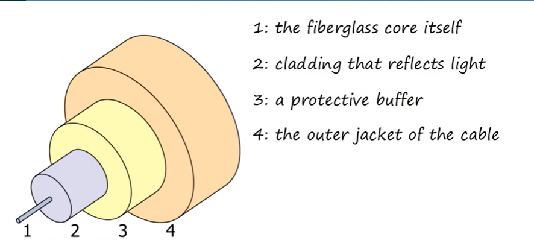
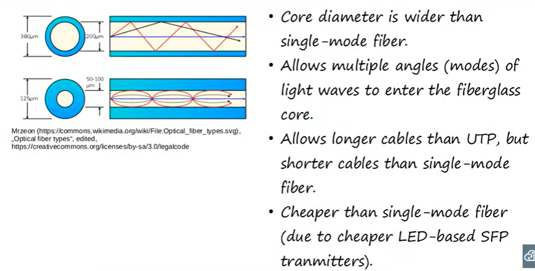
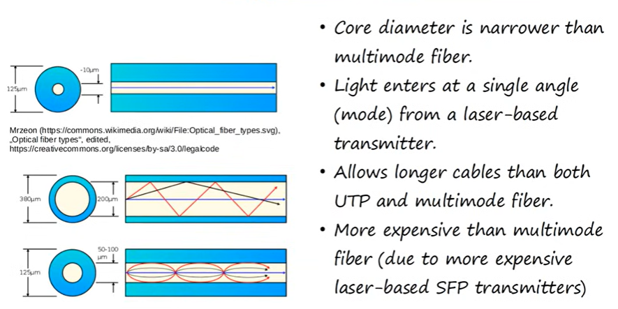

# Day 2 — Interfaces and Cables
📅 Date: 05/06/2026
🎥 Video: [Jeremy's IT Lab - Title](https://www.youtube.com/watch?v=ieTH5lVhNaY&list=PLxbwE86jKRgMpuZuLBivzlM8s2Dk5lXBQ&index=4)

---

# 📝

# What is an Ethernet?
    - Ethernet is a collection of network protocols/standards. 

# Why do we need Ethernet standards/protocols?
    - Think of it this way:
        - standards allow makers of network devices and cables to adhere to the physical (sizing and length of cables) and logical (IP - internet protocol) standards
        - An analogy : A maker of a switch will adhere to the standards to ensure that cables will be able to fit into the ports of the switch. vice versa. 

# Ethernet Standards
    - Defined in the IEEE 802.3 standard in 1983
    - IEEE = institute of electrical and electronic engineers
    
# Speed
    - Connections between devices in a network operate at a set speed
    - Speed is measured in bits per second (Kbps, Mgps, Gbps, etc), not bytes per second.

# Bits and Bytes
    - Bits:
        - Binary value of 0 or 1. 
        - 1 bit = 1 value. Example: 01 = 2 bits. 010 = 3 bits. 01100111 = 8 bits. 
        - Data is sent to neighbouring devices 1 bit at a time. 

    - Bytes:
        - 8 bits = 1 byte. 

    - Conversion:
        1 kilobit(Kb) = 1000 bits
        1 megabit(Mb) = 1000000 bits
        1 gigabit (Gb) = 1000000000 bits
        1 terabit (Tb) = 1000000000000 bits
        All in increment of 3 zeros. 

# RJ-45 Ports
    - RJ (Registered Jack)
    - Looks like an ethernet cable port
    - ports that you will connect copper utp cables to. 

# Cables

## Copper UTP Cables (Unshielded Twisted Pair cables)

    - Copper UTP cable standards:
    | Speed | Common Name | IEEE Standard | Informal Name | Maximum Length |
    |-------|-------------|---------------|---------------|----------------|
    | 10 Mbps | Ethernet | 802.3i | 10BASE-T | 100m |
    | 100 Mbps | Fast Ethernet | 802.3u | 100BASE-T | 100m |
    | 1 Gbps | Gigabit Ethernet | 802.3ab | 1000BASE-T | 100m |
    | 10 Gbps | 10 Gigabit Ethernet | 802.3an | 10GBASE-T | 100m |

    *BASE - baseband signalling (beyond the scope of ccna)
    *T - twisted pair cabling

    100m is the maximum length for twisted pair cables for technical and performance reasons.

    - Unshielded = vulnerable to electrical interferences due to no metallic shield.
    - Twisted Pair = protects against electromagnetic interferences (EMI)
        - 4 pairs of wires twisted together = 8 total wires. 
    
    **Different Ethernet standards use different numbers of wire pairings.** 
        - 10BASE-T & 100BASE-T
            - use 2 pairs = 4 wires
        - 1000BASE-T & 10GBASE-T
            - use 4 pairs = 8 wires

    **When connecting from a PC/Router/Firewall/Server to a Switch for 10BASE-T and 100BASE-T**
        - Using a straight-through cable 
        - PC/Router/Firewall/Server Transmit (Tx) data on pins 1 and 2
        - Switch receives (Rx) on pins 3 and 6. 
        - There are a total of 8 pins. 
    
    **When transmitting data to switch between PC/Router/Firewall/Server for 10BASE-T and 100BASE-T**
        - Use a crossover cable. 
        - Pin 1 from one end will connect to pin 3 on the other end
        - Pin 2 from one end will connect to pin 6 on the other end
        - For a crossover cable - data doesn't flow straight-through to pins 1 and 2 on the other end. 
        - Hence, devices that transmit and receive data on the same pins, we use crossover cables. 

    FOR 10BASE-T AND 100BASE-T
    | Device Type | Transmit (Tx) pins | Receive (Rx) pins |
    |-------------|--------------------|-------------------|
    | Router | 1,2 | 3,6 |
    | Firewall | 1,2 | 3,6 | 
    | PC | 1,2 | 3,6 | 
    | Switch | 3,6 | 1,2 |  

    For 1000BASE-T and 10GBASE-T:
        - Each pair is bi-directional. They are able to send and receive data on all pins. 
        - 1 of the reasons why it's speed is faster than 10BASE-T and 100BASE-T

# Auto MDI-X
Modern feature that allows devices to automatically detect which pins the devices are transmitting data on and then automatically adjust which pins transmit and receives data when 2 devices are connected to each other. Removes the headache of straight-through and crossover cables
 
# Fiber-Optic Cables
    - Fiber-Optic cables standard
    | Speed | Cable Type | IEEE Standard | Informal Name | Maximum Length |
    |-------|------------|---------------|---------------|----------------|
    | 1Gbps | Multi-Mode or Single Mode | 802.3z | 1000BASE-LX | 550m(MM) or 5km(SM) |
    | 10Gbps | Multi-Mode | 802.3ae | 100BASE-SR | 400m |
    | 10Gbps | Single Mode | 802.3ae | 1000BASE-LR | 10km |
    | 10Gbps | Single Mode | 802.3ae | 10GBASE-ER | 30m |

    - Insert SFP (Small Form-Factor Pluggable) transceiver into ports.
    - Fiber-optic cables are then connected into the SFP transceiver.
        - Sends light over glass fiber instead of an electrical signal over copper wiring.
        - 2 connectors on each end. 1 to transmit (Tx) data and 1 to receive (Rx) data.
        - Use seperate cables within to transmit and receive data.

**Structure of a fiber-optic cable**

image courtesy of jeremy's it labs

**Multi-Mode fiber-optic cable**

image courtesy of jeremy's it labs

**Single-Mode fiber-optic cable**

image courtesy of jeremy's it labs

## UTP VS FIBER-OPTIC CABLES

| UTP | FIBER-OPTIC |
|-----|-------------|
| lower cost than fiber-optic | higher cost than UTP |
| shorter maximum distance than fiber-optic (~100m) | longer maximum distance than UTP | 
| can be vulnerable to EMI but twisted pair wires help that | no vulnerability to EMI | 
| RJ45 ports used with UTP are cheaper than SFP ports used with fiber-optic | SFP ports are more expensive than RJ45 ports (single mode is more expensive than multi mode) |  
| emit (leak) a faint signal outside of the cable which can be copied (= security risk) | does not emit any signal outside of the cable (= no security risk) |

---

---

## 🖥️ Lab Notes 
This lab requires you to remember the characteristics of the respective cables and their modes. Then connect network devices to each other using the appropriate cables. Great way to cement your knowledge and put it to practise. 
---
